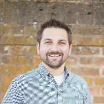

# About Michael

Michael is a Staff Software Engineer at Plexus in Raleigh, NC, where he primarily focuses on developing embedded C++ software for medical devices. Over a decade of experience at contract engineering companies has given him opportunities to work on a variety of projects ranging from green-field design to final verification testing. Michael is passionate about software design, architecture, and unit testing, and he is always looking for opportunities to learn.

Presentations:

* C++Now 2024: [Developing Better Code by Isolating Decisions](https://schedule.cppnow.org/session/2024/developing-better-code-by-isolating-decisions/)
* C++Now 2024 Lightning Talk: [Debugging Like House](https://youtu.be/qwtVc5OATkE?si=3h_GEgPcCTVWBztj)
